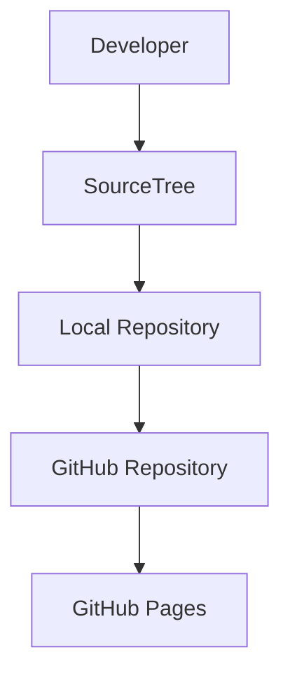

# CSI204 Workshop #1
## Project Documentation with GitHub

> **Course:** CSI204 - Digital Platform for Software Development

---

# Student Information

| Item | Information |
|------|-------------|
| Name | Thatsanon Kaisomsat |
| Student ID | 67112761 |
| Section | T001 |

> แก้ Student ID และ Section เป็นข้อมูลจริง

---

# Project Overview

This workshop demonstrates the use of Git, GitHub, SourceTree, Markdown, and GitHub Pages for software project documentation.

The project focuses on learning version control, collaboration, project documentation, and website publishing through GitHub.

---

# Objectives

- Learn Git Version Control
- Learn GitHub Repository
- Learn SourceTree
- Learn Markdown Documentation
- Learn GitHub Pages
- Understand Branching and Merging

---

# Analysis

## Problem

Managing software projects without version control can lead to file duplication, data loss, and collaboration issues.

## Solution

Git and GitHub provide version control, while SourceTree offers a graphical interface for managing repositories efficiently.

## Benefits

- Version Control
- Easy Collaboration
- Backup on Cloud
- Project History
- Easy Rollback

---

# Design

## Git Workflow

1. Create Repository
2. Clone Repository
3. Add Project Files
4. Commit
5. Push
6. Pull
7. Create Branch
8. Merge Branch

---

# System Architecture



---

# Workshop Activities

## Step 1

Created GitHub Repository successfully.

## Step 2

Cloned repository using SourceTree.

## Step 3

Added project file

```
hello.txt
```

## Step 4

Commit Message

```
Add hello.txt
```

## Step 5

Push changes to GitHub.

## Step 6

Pull latest changes.

## Step 7

Created branch

```
feature-test
```

## Step 8

Modified

```
hello.txt
```

Added

```
This is feature branch.
```

## Step 9

Commit Message

```
Update hello.txt in feature branch
```

## Step 10

Merged feature-test into main successfully.

---

# Repository Structure

```
CSI204-Lab3
│
├── README.md
├── index.html
└── hello.txt
```

---

# Screenshots

> เพิ่มภาพหน้าจอในโฟลเดอร์ assets เช่น

- GitHub Repository
- SourceTree Commit History
- Merge Result
- GitHub Pages

ตัวอย่าง

```
assets/
├── repository.png
├── commit-history.png
├── merge.png
└── github-pages.png
```

---

# Technologies

- Git
- GitHub
- SourceTree
- Markdown
- Mermaid
- GitHub Pages

---

# Repository URL

https://github.com/Thxsnxn/Thxsnxn-CSI204-Lab3.git

---

# GitHub Pages

https://thxsnxn.github.io/Thxsnxn-CSI204-Lab3/

---

# Conclusion

This workshop successfully demonstrates the use of Git, GitHub, SourceTree, Markdown documentation, Branching, Merging, and GitHub Pages for software development workflow.

---

# References

- https://git-scm.com/
- https://github.com/
- https://docs.github.com/